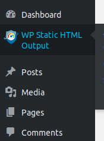

# WordPress Static HTML Output

Allows you to leverage WordPress as a great CMS, but benefit from the speed, security and portability that a static website provides.

---
    
## Features

 - generates a standalone, static html copy of your whole WordPress website
 - auto-deploy to local folder, FTP, Dropbox, S3, GitHub Pages, Netlify or BunnyCDN
 - scheduled exports via WP-Crontrol of by hitting the custom hook
 - one site to unlimited export targets
 - specify extra files to include in the output (ie, dynamically loaded assets)
 - desktop notifications alert you to when exports are complete
 - multi-language support (English/Japanese currently)

## Use cases

 - Securing a website from malicious attacks/malware
 - Fastest hosting options for static websites
 - Free hosting via GitHub, GitLab, BitBucket, etc.
 - Website archival
 - Cheap, fast and secure hosting for a digital agency

## Setting Up
 1. From your dashboard, go to `Plugins` > `Add New`.
    > 
 2. Add the plugin either from file or from the Wordpress dashboard.
    > 
    - From file: Click the `Upload Plugin` button and upload the plugin file. This file can be found in [the releases tab](https://github.com/leonstafford/wordpress-static-html-plugin/releases) or from [the Wordpress plugin directory](https://wordpress.org/plugins/static-html-output-plugin/).
    - From the Wordpress dashboard: Search for "**WP Static HTML Output**". Click the `Install Now` button on the top right corner of the plugin by **Leon Stafford**.
 3. Once the plugin is done installing, activate the plugin.
    - If available, click the `Activate` button on the top right corner of the card.
      > 
    - Otherwise, from the dashboard, go to `Plugins` > `Installed Plugins`. Locate the newly installed **WP Static HTML Output** plugin, and click `Activate`.
      > 
 4. Choose `Allow & Continue` or `Skip` depending on your preferences.
    > 
 5. To use the plugin, go to your dashboard and go to `Tools` > `WP Static HTML Output`.
    > 
 6. When you're done configuring, scroll down to the **Export your site** section and click the `Start static site export` button. Have fun!
    > 

### Scheduling exports via CRON/WP-CRON, etc

Using the [WP Crontrol](https://wordpress.org/plugins/wp-crontrol/) plugin, you can add this hook to a schedule to trigger an export: `wp_static_html_output_server_side_export_hook`. This will run your export using the settings you've saved via the GUI. Via this method, you can schedule your exports to happen daily or if you're after an *on-post publish* kind of behaviour, you could set this to every few minutes.

## Roadmap

A [Waffle.io project board](https://waffle.io/leonstafford/wordpress-static-html-plugin) shows what is upcoming and being worked on. You can filter the board by bugs, new features, enhancements, etc.

### other things in the works

 - selectively export only changed pages since last output
 - more export targets (GitLab, BitBucket and more)
 - auto trigger an export on a post/page publish action
 - WP CLI integration
 - submission of bug report from within plugin
 - backwards compatibility with older php and wordpress versions (degrade gracefully) (delayed until further release)

## Development

Latest development build status: 

This repo contains the latest code, which you can clone/download to get the bleeding edge, else install via the [official WordPress Plugin page](https://wordpress.org/plugins/static-html-output-plugin/)

If you'd like to contribute, please follow the usual GitHub procedures (create an Issue, fork repo, submit PR). If you're unsure about any of that, contact me and I'll be happy to help. 

### Demo website content

Included in the `./demo_site_content/` dir, are the posts used for the demo sites for this plugin, including guides on functionality. 

To capture content from the development instance, run `./provisioning/backup_demo_content.sh`

There is a great [Dockerized FTP server](https://github.com/stilliard/docker-pure-ftpd) which I've found useful in development. I may extend this to also serve the hosted files for more complete test capabilities. So long as you can install Docker, this is a much less painful way to get a local FTP server and users setup than what I've experienced before.

### Localisation / translations

Uses the [https://github.com/cedaro/grunt-wp-i18n](https://github.com/cedaro/grunt-wp-i18n) npm module and the Gruntfile.js in the project root. `npm i -g grunt` then `grunt` to scan plugin source and generate a new `languages/static-html-output-plugin.pot` file.

A `packages.json` file and `.nvmrc` exist to help show the dependencies required to get the grunt task working.

Our official [translation page](https://translate.wordpress.org/projects/wp-plugins/static-html-output-plugin) on wordpress.org. 

## Support

Please [raise an issue](https://github.com/leonstafford/wordpress-static-html-plugin/issues/new) here on GitHub or on the plugin's [support forum](https://wordpress.org/support/plugin/static-html-output-plugin).

## Contact

Email the lead developer, Leon Stafford, at [leonstafford@protonmail.com](mailto:leonstafford@protonmail.com), open an issue here on GitHub or make a support request from within the plugin itself. 

